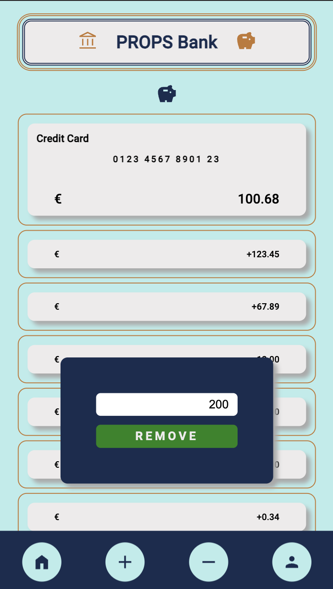

### Prop Bank (Mobile First) with Global State (useContext) & React Router

The login is currently only fake and for now only one link, so you can click and test the app without any problems.

# [Deployment]()

<div>





</div>

## How to set it up

Clone this repository

Install all dependencies: `npm install`

Run app in dev mode: npm run dev

Open your localhost

# A - How to use React Router in React

1 - Install React Router

`npm install react-router-dom`

2 - Configure the router

In your root component (here it's done in App.js) and define the routes for your application using the Route component. Wrap your application with the Router component to enable routing (example):

```jsx
import { BrowserRouter as Router, Route, Link } from "react-router-dom";

function App() {
  return (
    <Router>
      <Route path="/" exact component={Home} />
      <Route path="/about" component={About} />
    </Router>
  );
}
```

3 - Wrapp in main.js with the BrowserRouter your App, inside StrictMode. Example:

```jsx
import React from "react";
import ReactDOM from "react-dom/client";
import App from "./App.jsx";
import "./index.scss";
import { BrowserRouter } from "react-router-dom";

ReactDOM.createRoot(document.getElementById("root")).render(
  <React.StrictMode>
    // ⬇️ Here below ⬇️
    <BrowserRouter>
      <App />
    </BrowserRouter>
  </React.StrictMode>
);
```

4 - Create internal links
To navigate between routes, use the Link component provided by React Router (allways you need to import it). Example:

```js
import { Link } from "react-router-dom";

function Navigation() {
  return (
    <nav>
      <ul>
        <li>
          <Link to="/">Home</Link>
        </li>
        <li>
          <Link to="/about">About us</Link>
        </li>
      </ul>
    </nav>
  );
}
```

# B - How to use useContext for Global State in React

1 - Create a context file, e.g. AppContext.js to define your global context. Here is an example of how to do this:

```jsx
import { createContext, useContext, useState } from "react";

const AppContext = createContext();

export const useAppContext = () => useContext(AppContext);

export const AppProvider = ({ children }) => {
  const [globalState, setGlobalState] = useState(initialState); //your initial state: 0, "", [], etc..

  return (
    <AppContext.Provider value={{ globalState, setGlobalState }}>
      {children}
    </AppContext.Provider>
  );
};

AppProvider.propTypes = {
  children: PropTypes.node,
};
```

2 - Set up the core component (normally App.js), import AppProvider and wrap your application with it. (Check allways that the import path is correct, here is an example, the path depends on your own structure.)

```jsx
import React from "react";
import {  AppProvider  } from "./AppContext";

function App() {
  return (
     // ⬇️ Here below ⬇️
    <AppProvider>
      <App />
    <AppProvider>
  );
}

export default App;
```

However, in this repository I have done it in the root (main.js) because in the App are my Router with the routes.

```jsx
import React from "react";
import ReactDOM from "react-dom/client";
import App from "./App.jsx";
import "./index.scss";
import { BrowserRouter } from "react-router-dom";
import { AppProvider } from "./AppContext";

ReactDOM.createRoot(document.getElementById("root")).render(
  <React.StrictMode>
    <BrowserRouter>
      // ⬇️ Here below ⬇️
      <AppProvider>
        <App />
      </AppProvider>
    </BrowserRouter>
  </React.StrictMode>
);
```

3 - In any component where you want to access the global state, import and use your `useAppContext()` to get the context (curly brackets!). If you only need the state and not the setter, you can use only the state:

```jsx
import React from "react";
 // ⬇️ Here below ⬇️
import { useAppContext } from "./AppContext";

const MyComponent = () => {
     // ⬇️ Here below ⬇️
  const { globalState, setGlobalState } = useAppContext();
  ...
  return(
    <>
    ...
    </>
 );
};

export default MyComponent;
```
